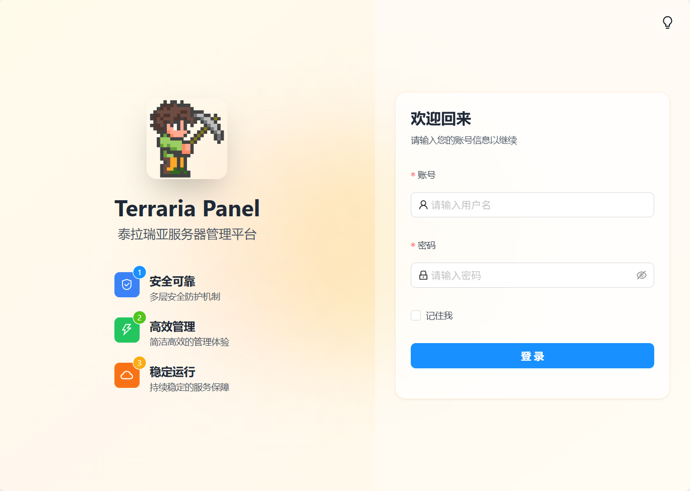
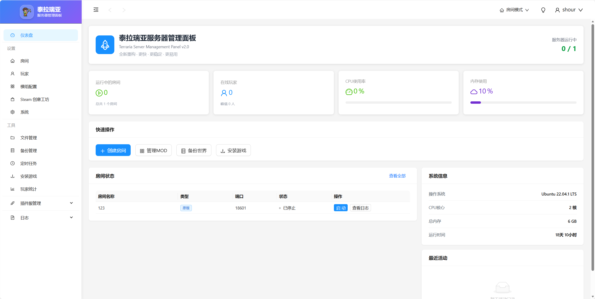
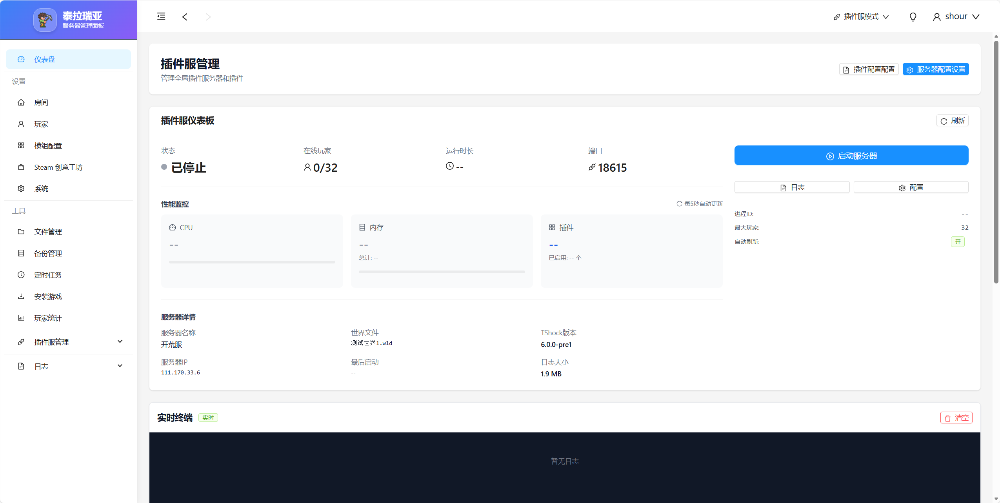
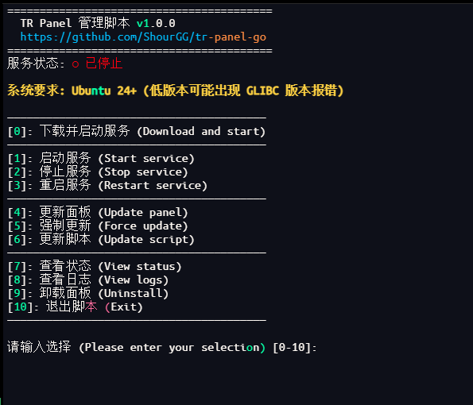

<div align="center">


# TR Panel Go

**轻量、高性能的泰拉瑞亚服务器管理面板**

*基于 Go 构建 · 单文件部署 · 面向自部署*

<br/>

[](https://golang.org)
[](LICENSE)
[](https://github.com/ShourGG/tr-panel-go/releases)

[](https://github.com/ShourGG/tr-panel-go/stargazers)
[](https://github.com/ShourGG/tr-panel-go/network)
[](https://github.com/ShourGG/tr-panel-go/issues)
[](https://github.com/ShourGG/tr-panel-go/commits)
[](https://github.com/ShourGG/tr-panel-go)
[](https://github.com/ShourGG/tr-panel-go)

<br/>

[快速安装](#快速安装) · [界面预览](#界面预览) · [功能特性](#功能特性) · [技术栈](#技术栈) · [问题反馈](https://github.com/ShourGG/tr-panel-go/issues)

</div>

---

## 项目简介

**TR Panel Go** 是一款专为泰拉瑞亚游戏服务器设计的 Web 管理面板，提供可视化界面和 Go 后端服务。

- **高性能**：Go 原生并发，API 响应 ~100ms，页面加载 ~78ms
- **零依赖部署**：前端静态资源内嵌进单一可执行文件，`wget` 即装即用
- **双模式支持**：原版泰拉瑞亚房间管理 + TShock 插件服模式无缝切换
- **国际化**：完整中英文双语界面
- **版本自检**：面板与脚本均支持自动检测新版本并提示更新

---

## 快速安装

> **系统要求：** Ubuntu 24.04+（低版本可能出现 GLIBC 兼容性报错）

**快速安装（wget）**

```bash
wget -O tr.sh https://raw.githubusercontent.com/ShourGG/tr-panel-go/main/tr.sh && chmod +x tr.sh && ./tr.sh
```

**快速安装（curl）**

```bash
curl -o tr.sh https://raw.githubusercontent.com/ShourGG/tr-panel-go/main/tr.sh && chmod +x tr.sh && ./tr.sh
```

运行后选择 **`[0] 下载并启动`**，默认访问端口：**`8800`**

**服务器非交互一键安装**

发布后可以直接执行下面一条命令。它会下载指定版本、保留已有 `data` / 世界 / 备份、创建或更新 systemd 服务，并通过本机 HTTP 检查后再报告成功：

```bash
rm -f /tmp/tr.sh && (curl -fsSL --retry 3 --connect-timeout 10 --max-time 30 https://gh-proxy.com/https://raw.githubusercontent.com/ShourGG/tr-panel-go/main/tr.sh -o /tmp/tr.sh || curl -fsSL --retry 3 --connect-timeout 10 --max-time 30 https://raw.githubusercontent.com/ShourGG/tr-panel-go/main/tr.sh -o /tmp/tr.sh) && chmod +x /tmp/tr.sh && /tmp/tr.sh --install --port 8800 --version v1.5.1-dev.13
```

如果使用 GitHub 直连较慢，把 `--version` 后的标签换成已发布的版本即可；不要把 `80`、`443` 或已被其他程序占用的 `7500` 当作面板端口。

### 本地构建与发布

仓库保存 Go 后端和已构建的嵌入前端；前端源码在配套前端工作区时，通过 `-FrontendDir` 指定它。构建脚本会运行 Go 全量测试、前端类型检查和 Vite 构建，将前端同步到 `web/dist`，再生成 Linux `amd64` 单文件和 `SHA256SUMS`：

```powershell
.\tools\build-release.ps1 `
  -Version v1.5.1-dev.13 `
  -FrontendDir 'D:\path\to\frontend'
git add .
git commit -m "feat: add unified room console commands"
git push origin main
.\tools\publish-release.ps1 -Version v1.5.1-dev.13
```

`publish-release.ps1` 使用本机已登录的 GitHub CLI 创建 prerelease，并上传 `terraria-panel` 与校验文件。稳定版发布时加上 `-Stable`。

---

## 界面预览

<table>
  <tr>
    <td align="center"><b>登录界面</b></td>
    <td align="center"><b>仪表盘</b></td>
  </tr>
  <tr>
    <td></td>
    <td></td>
  </tr>
  <tr>
    <td align="center"><b>插件服务器管理</b></td>
    <td align="center"><b>安装脚本菜单</b></td>
  </tr>
  <tr>
    <td></td>
    <td></td>
  </tr>
</table>

---

## 功能特性

### 服务器管理
- 多房间实例创建、启停控制与状态监控
- WebSocket 实时日志推送，延迟 <50ms
- TShock 版本自动检测与适配

### 玩家管理
- 在线玩家列表与实时状态
- 会话记录、历史统计、活动审计
- 踢出、封禁等管理操作

### 插件生态
- 插件安装、卸载、热重载
- 插件配置文件可视化编辑（Monaco Editor）
- TShock 数据库直连管理

### 系统功能
- 在线文件管理器（上传 / 下载 / 编辑 / 删除）
- 自动备份与恢复
- 定时任务调度（cron 表达式）
- CPU / 内存 / 磁盘 / 网络实时监控图表

---

## 技术栈

| 层级 | 技术 |
|------|------|
| 后端语言 | Go 1.21+ |
| Web 框架 | Gin |
| 实时通信 | gorilla/websocket |
| 数据库 | SQLite 3 |
| 认证 | JWT Token |
| 任务调度 | robfig/cron |
| 前端框架 | Vue 3 + TypeScript |
| UI 组件 | Tailwind CSS + shadcn/ui |
| 代码编辑器 | Monaco Editor |
| 图表 | ECharts |

---

## 可选：下载直出加速

面板默认可以直接由 Go 进程完成备份下载、文件下载。  
如果你前面还有 Nginx，也可以开启 `X-Accel-Redirect`，让备份 zip 和文件管理里的普通文件由 Nginx 直出，减轻 Go 进程压力。

`.env` 示例：

```bash
DOWNLOAD_TICKET_TTL=90
DOWNLOAD_ACCEL_ENABLED=true
DOWNLOAD_ACCEL_TYPE=nginx
DOWNLOAD_ACCEL_BACKUP_PREFIX=/__downloads/backups
DOWNLOAD_ACCEL_DATA_PREFIX=/__downloads/data
```

Nginx 示例：

```nginx
location /__downloads/backups/ {
    internal;
    alias /opt/tr-panel/data/backups/;
}

location /__downloads/data/ {
    internal;
    alias /opt/tr-panel/data/;
}
```

说明：

- 不配 Nginx 也能正常下载，面板会自动回退到 Go 直出
- 目录打包下载、动态 zip 下载仍然走 Go 流式输出
- 下载链接改为短时票据，不再把长期登录 token 直接挂在 URL 上

---

## 性能基准

| 指标 | 数值 |
|------|------|
| API 平均响应时间 | ~100ms |
| 页面首次加载 | ~78ms |
| LCP（最大内容渲染） | ~105ms |
| 数据库查询优化幅度 | 50–80% |
| 打包产物大小 | ~15MB（含完整前端） |

---

## 脚本管理菜单

```
[0]  下载并启动服务     [1]  启动服务
[2]  停止服务          [3]  重启服务
[4]  更新面板          [5]  强制更新
[6]  更新脚本          [7]  查看状态
[8]  查看日志          [9]  修改端口
[10] 卸载面板          [11] 退出
```

> 脚本会在每次启动时自动检测自身是否有新版本，有更新时醒目提示。

---

## 开源协议

本项目采用 [CC BY-NC 4.0](LICENSE) 协议。

- 允许个人学习、非商业使用与二次分发
- **禁止商业使用** — 不得用于盈利项目或商业产品

---

## 作者

由 **[ShourGG](https://github.com/ShourGG)** 独立开发与维护。

如果这个项目对你有帮助，欢迎点个 Star 支持。

---

<div align="center">

[回到顶部](#tr-panel-go)

</div>
